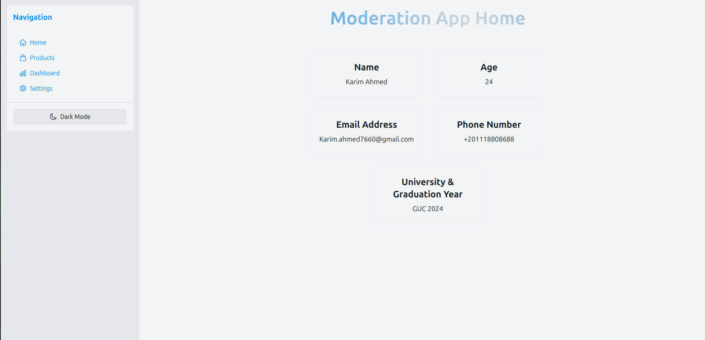
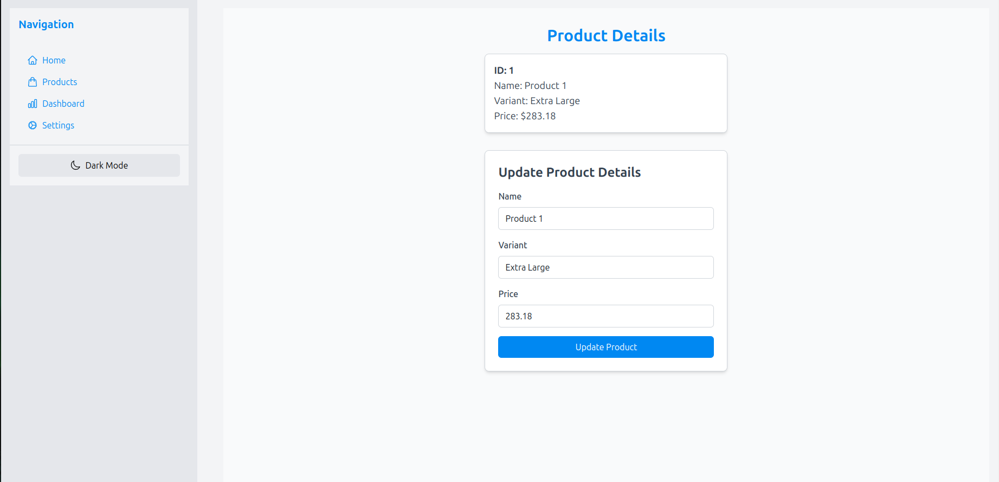
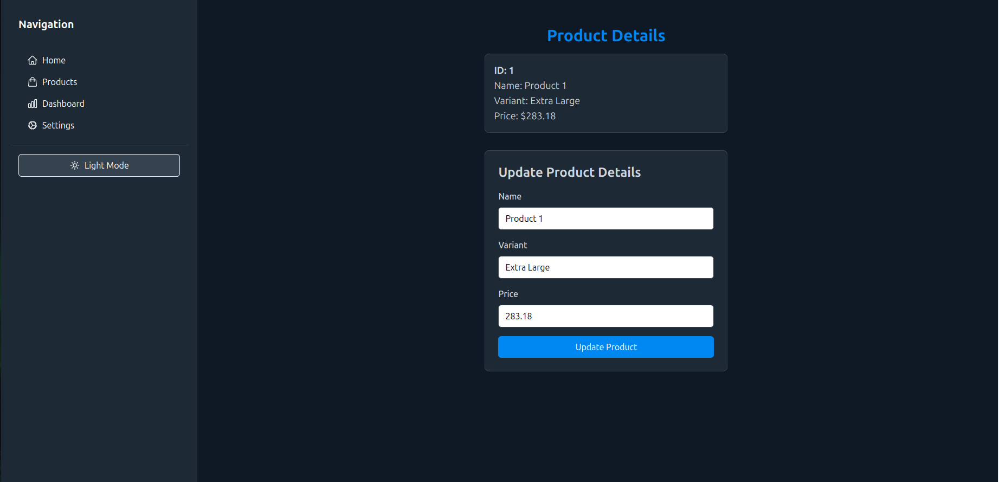
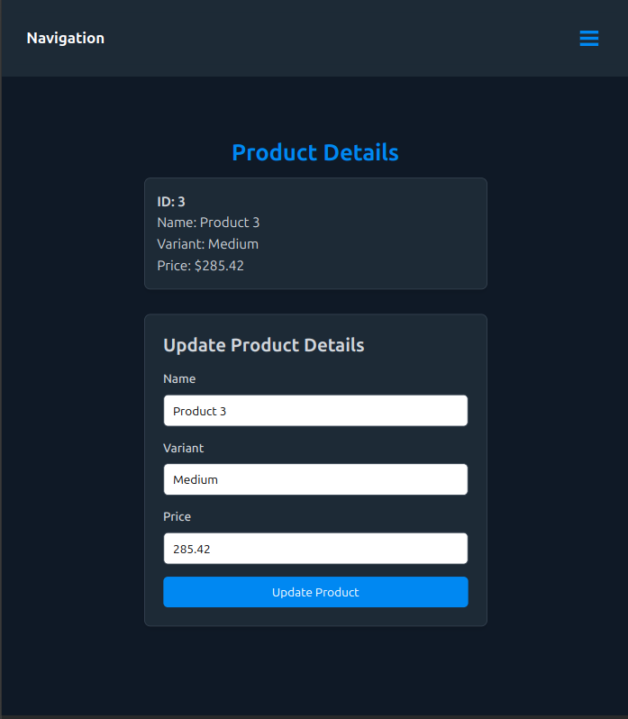
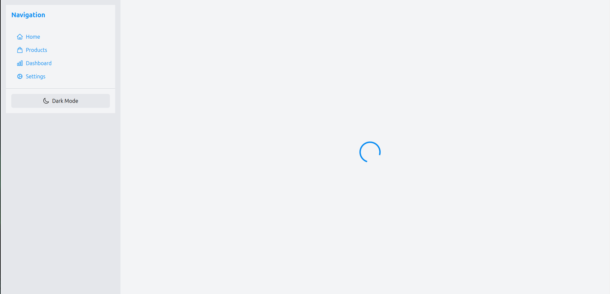
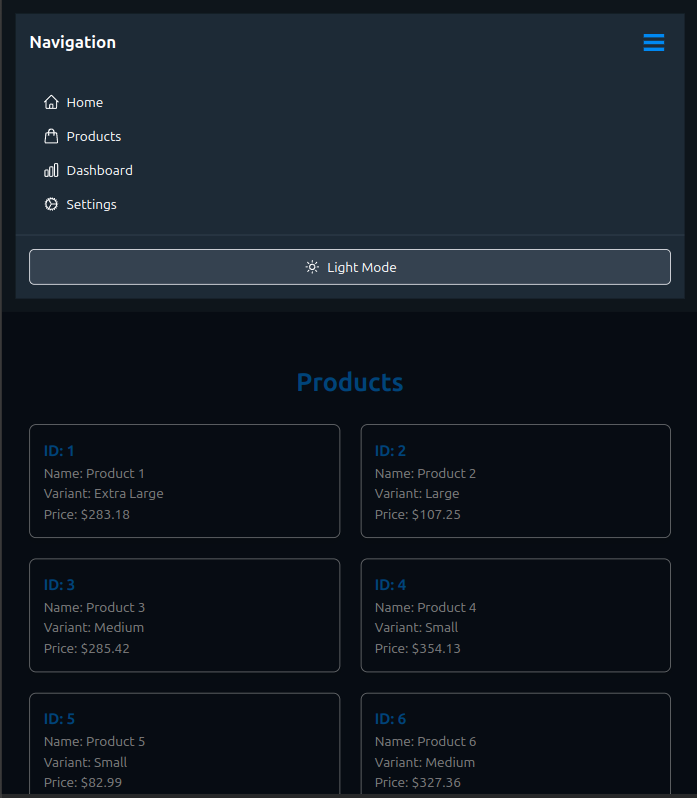
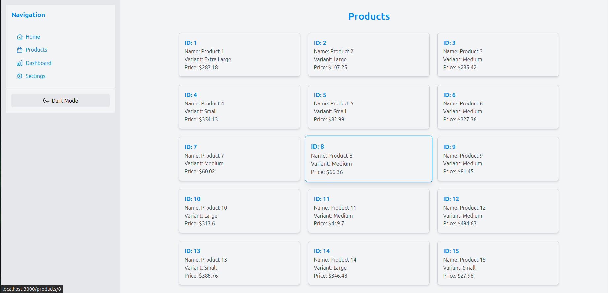
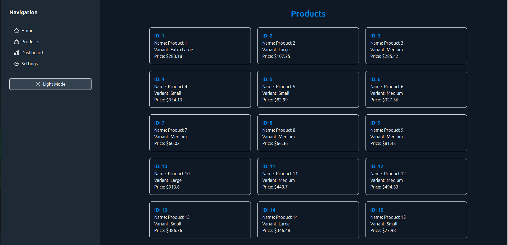
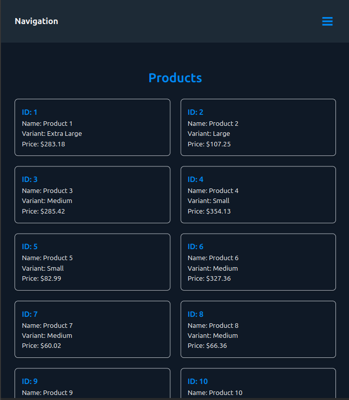

# Moderation App - Next.js Project

This project is a **Moderation App** built using **Next.js** and styled with **Tailwind CSS**. The app demonstrates modular component design, responsiveness, dark/light theme toggling, API integration, and an intuitive user interface for managing and viewing products.

---

## Table of Contents

1. [Features](#features)
2. [Folder Structure](#folder-structure)
3. [Installation and Setup](#installation-and-setup)
4. [Available Scripts](#available-scripts)
5. [Components](#components)
6. [Pages and Navigation](#pages-and-navigation)
7. [API Integration](#api-integration)
8. [Dark/Light Theme Toggle](#darklight-theme-toggle)
9. [Responsive Design](#responsive-design)
10. [Contributing](#contributing)

---

## Features

- Modular and reusable components.
- Responsive layout with **Tailwind CSS**.
- Persistent dark/light theme toggle.
- Product listing with pagination.
- Detailed product view with update functionality.
- Side navigation with collapsible menu on smaller screens.

---

## Folder Structure

```
nextjs-blog
├── components
│   ├── Button.js
│   ├── ProductCard.js
│   ├── SideNav.js
│   ├── cardComponent.js
├── pages
│   ├── index.js
│   ├── products.js
│   ├── products
│       ├── [id].js
│   ├── _app.js
│   ├── tbd.js
├── styles
│   ├── global.css
├── tailwind.config.js
├── package.json
```

### Key Files and Directories

- **components/**: Contains all reusable React components.
- **pages/**: Contains Next.js pages, including dynamic routing.
- **styles/**: Global CSS styles managed by Tailwind.
- **tailwind.config.js**: Tailwind configuration for customization.

---

## Installation and Setup

### Prerequisites

- **Node.js** (v14 or higher recommended)
- **npm** or **yarn**

### Steps

1. Clone the repository:
   ```bash
   git clone https://github.com/rexmirak/Warehouse-Moderator-App
   cd nextjs-blog
   ```

2. Install dependencies:
   ```bash
   npm install
   ```

3. Start the development server:
   ```bash
   npm run dev
   ```

4. Open the app in your browser at `http://localhost:3000`.

---

## Available Scripts

### `npm run dev`
Starts the development server.

### `npm run build`
Builds the app for production.

### `npm start`
Starts the production server after building the app.

---

## Components

### 1. **Button.js**
A reusable button component that supports icons and hover effects.

### 2. **ProductCard.js**
Displays product details such as ID, name, variant, and price. Includes hover animations.

### 3. **SideNav.js**
Responsive side navigation with links to different pages and a theme toggle button.

---

## Pages and Navigation

### 1. **Home Page (index.js)**
`/` The landing page with key information.

### 2. **Products Page (products.js)**
`/products` Lists products with a grid layout and pagination.

### 3. **Product Details Page (products/[id].js)**
`/products/[id]` Displays detailed information for a single product. Includes a form to update product details.

### 4. **To Be Determined Page (tbd.js)**
`/tbd` Placeholder for future features.

---

## API Integration

### Product Data Source
The app fetches product data from mockapi.io to simulate API calls

### Fetch Example
Data is fetched using the `fetch` API in components and pages. Example:
```javascript
useEffect(() => {
  async function fetchProduct() {
    const response = await fetch('<mockapi.io API url>');
    const data = await response.json();
    setProducts(data);
  }
  fetchProduct();
}, []);
```

---

## Dark/Light Theme Toggle

The theme toggle is implemented using Tailwind's `dark` mode. Preferences are persisted in `localStorage`.

### Key Features:
- **Button in `SideNav.js`**: Toggles between light and dark mode.
- **Persistent State**: Remembers the last selected theme.
- **Tailwind Classes**: Applies `dark:` classes for styling.

---

## Responsive Design

The layout uses **Tailwind CSS**'s responsive utilities. Key breakpoints include:

- **Mobile**: Hamburger menu for the side navigation.
- **Desktop**: Full-width navigation with content adjusted accordingly.

---
## Screenshots

##### 1. Home Page in Light Mood 


##### 2. Product Details Page in Light Mood 


##### 3. Product Details Page in Dark Mood 


##### 4. Product Details Page in Dark Mood Small Screen 


##### 5. Loading Screen Light Mood 


##### 6. Loading Screen Dark Mood 


##### 7. Collapsable Menu in Small Screen


##### 8. Products Page in Light Mood 


##### 9. Products Page in Dark Mood 


##### 10. Products Page in Dark Mood Small Screen 


---

## Contributing

1. Fork the repository.
2. Create a new branch:
   ```bash
   git checkout -b feat/your-feature-name
   ```
3. Commit your changes:
   ```bash
   git commit -m "Add your message here"
   ```
4. Push to the branch:
   ```bash
   git push origin feat/your-feature-name
   ```
5. Create a pull request.

###### (Replace feat for fix for fixing any bugs)
---

For any questions or feedback, feel free to reach out!

